# 🚀 ClientFlow AI - Enterprise Client Portal & Team Workspace Suite

ClientFlow AI is a state-of-the-art multi-tenant client collaboration portal and agile engineering workspace built for agencies, software teams, consultancies, and enterprise clients. It unifies **Real-Time Gemini AI SSE Token Streaming**, an **AI Command Center Hub** (Scope Creep Detector, Sentiment Radar, Smart Task Assigner), **Dual Company & Client Login Portals**, 1-click deliverable sign-offs with versioning (v1, v2, v3), Kanban sprint tracking, deterministic project health telemetry, and publication-grade executive PDF reporting.

---

## 📸 Complete Platform Visual Showcase

### 1. Dual Sign-In Portals & Navigation (`/login`)
| Company & Agency Workspace Login | Enterprise Client Portal Sign-In |
| :---: | :---: |
| 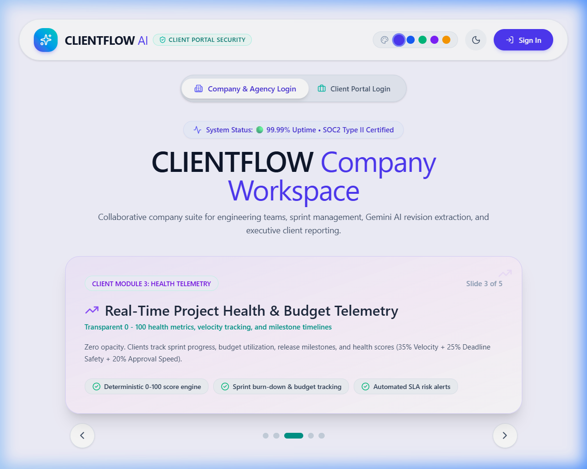 | 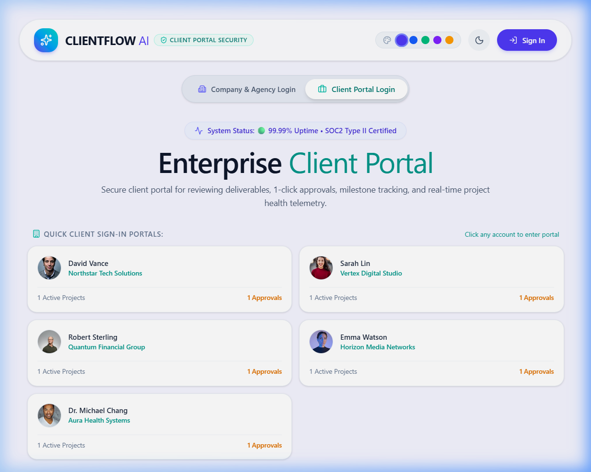 |

---

### 2. Agency Overview Dashboard & Floating Real-Time AI Copilot (`/`)
| Executive Dashboard & 8 Analytics Charts | Global Floating SSE AI Copilot Widget |
| :---: | :---: |
| 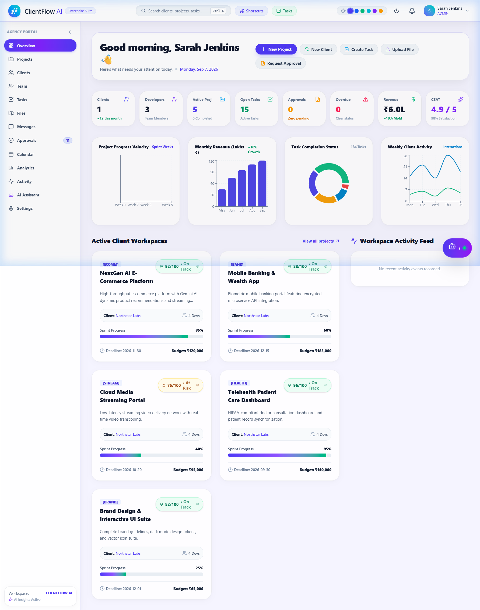 | 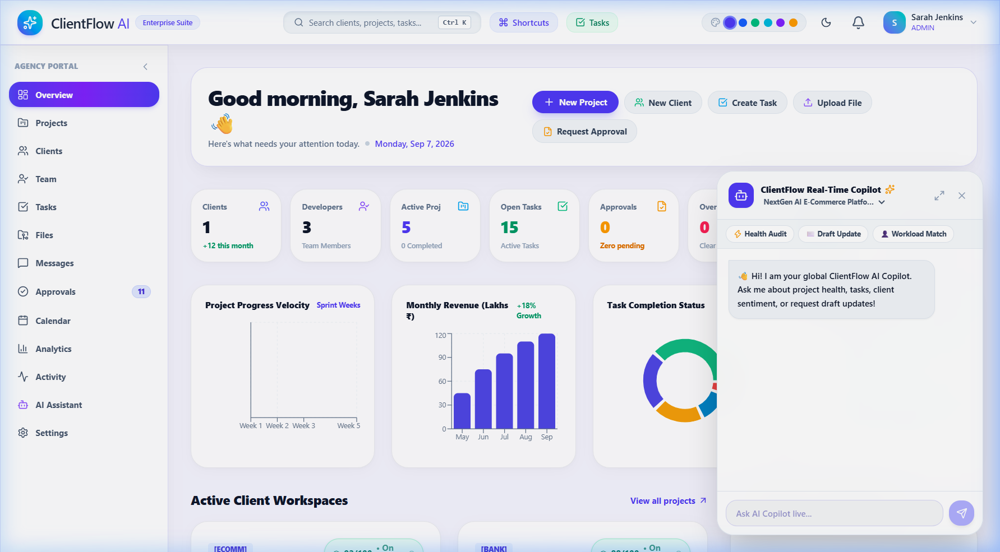 |

---

### 3. AI Command Center Hub & Intelligence Assistant (`/ai-assistant`)
| AI Command Center (Scope Creep & Sentiment Radar) | Real-Time AI Copilot Q&A |
| :---: | :---: |
| 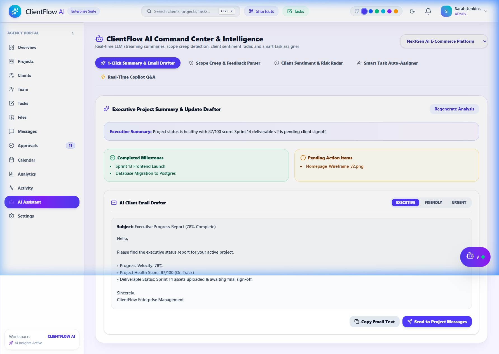 | 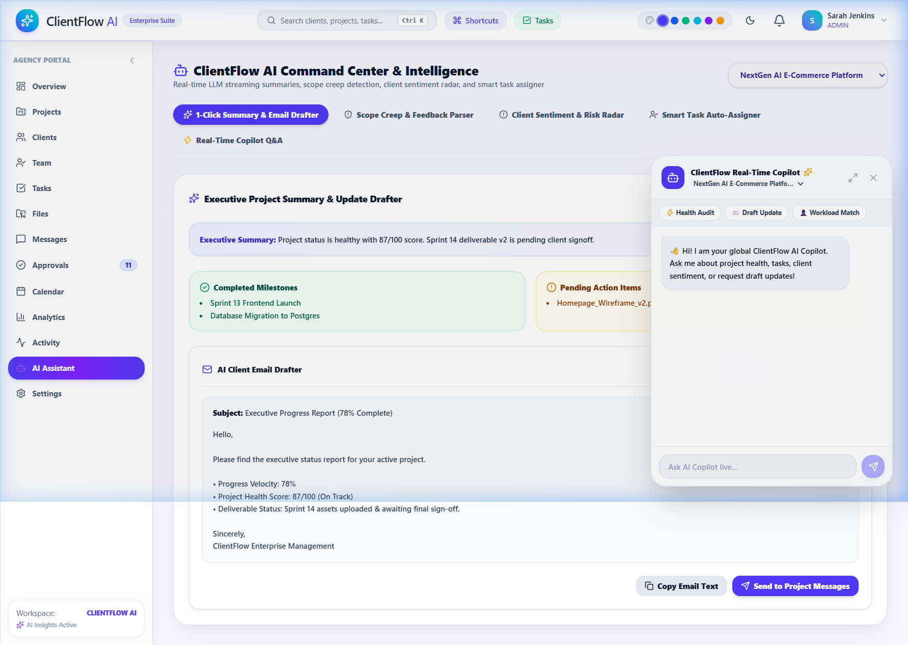 |

---

### 4. Active Project Workspaces & Sprint Kanban Board (`/projects` & `/kanban`)
| 5 Core Project Workspaces | Sprint Kanban Swimlanes (25 Tasks) |
| :---: | :---: |
| 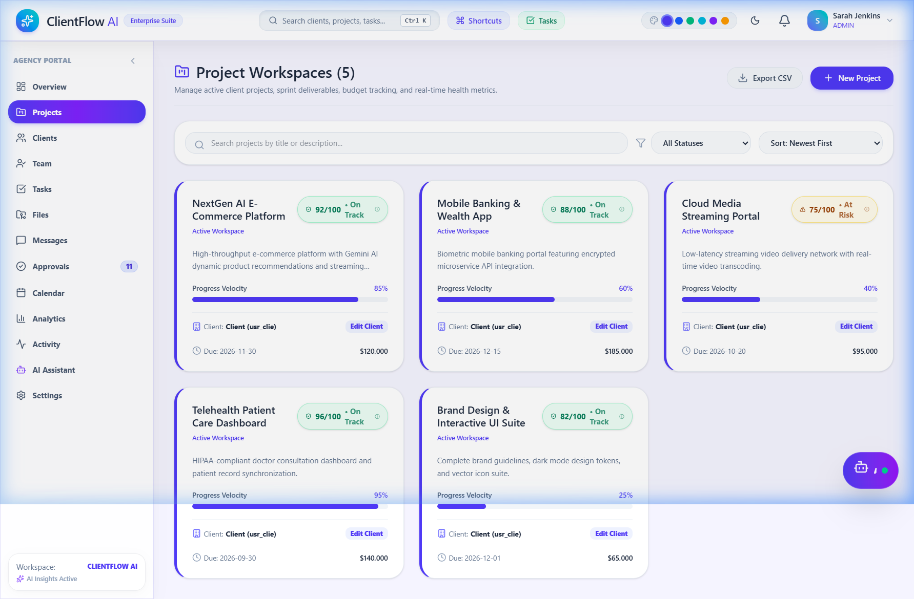 | 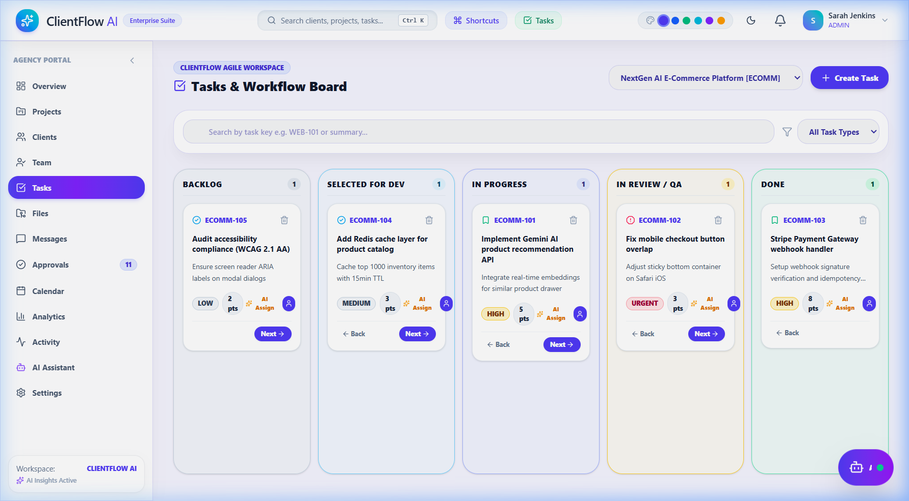 |

---

### 5. Client Directory, Team Members & Collaboration (`/clients`, `/team`, `/messages`)
| Client Directory & Sentiment Radar | Agency Team Directory (5 Engineers) |
| :---: | :---: |
| 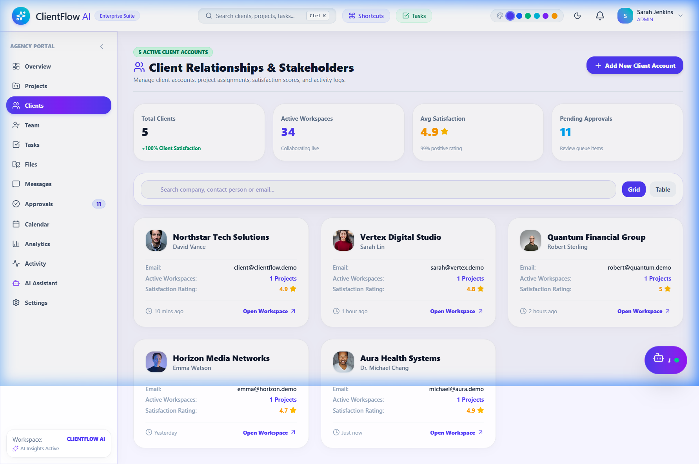 | 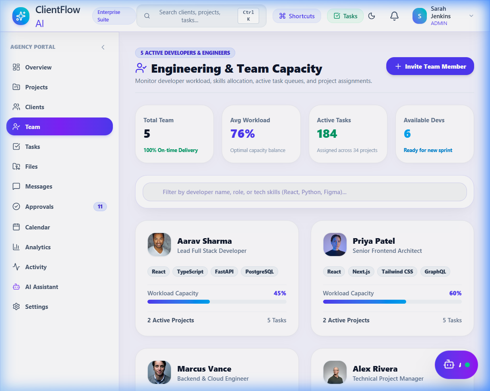 |

---

### 6. Deliverable Sign-Off Queue & Theme Customization (`/approvals` & Dark Mode)
| 1-Click Deliverable Approval Queue | Dark Mode & Accent Theme Customizer |
| :---: | :---: |
| 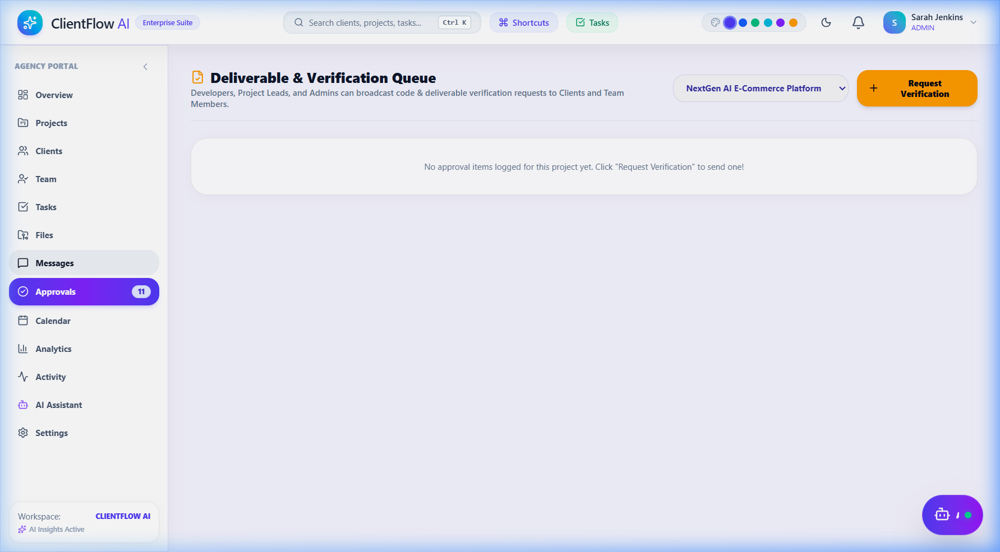 | 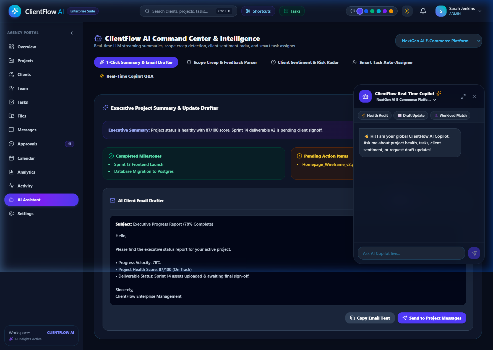 |

---

## 🔑 Pre-Seeded Demo Accounts & Credentials

| Role | Email | Password | Primary Workspace Capabilities |
| :--- | :--- | :--- | :--- |
| **Admin** | `admin@clientflow.demo` | `Demo@123` | Full workspace admin, org setup, team management, executive reports |
| **Client Account** | `client@clientflow.demo` | `Demo@123` | Dedicated Client Portal, 1-click deliverable sign-offs, action center |
| **Project Lead (PM)** | `manager@clientflow.demo` | `Demo@123` | Project health telemetry, sprint task creation, deliverable versioning |
| **Senior Developer** | `developer@clientflow.demo` | `Demo@123` | Kanban task moves, code deliverable uploads, story point estimation |

---

## 🌟 Major Features & AI Capabilities

1. **✨ Real-Time Gemini AI Copilot (Server-Sent Events Streaming)**:
   - Floating glassmorphism AI Copilot widget on all pages with typewriter token streaming over SSE (`POST /api/ai/projects/{id}/chat/stream`).

2. **🤖 AI Command Center Hub (`/ai-assistant`)**:
   - **Executive Summary & Multi-Tone Update Drafter**: Instant draft status emails in *Executive*, *Friendly*, or *Urgent* tones.
   - **Scope Creep & Out-of-Scope Detector**: Analyzes client feedback to detect out-of-scope feature requests, calculating extra developer hours and financial cost impact.
   - **Client Sentiment & Risk Radar**: Analyzes approval review lag, communication friction, and client satisfaction metrics.
   - **Smart Task Auto-Assigner**: Workload-aware engineer matcher suggesting the optimal developer based on capacity and skill tags.

3. **🔑 Dual Login Portals (`/login`)**:
   - Distinct **Company Workspace** and **Client Portal** logins with top navbar `Sign In` button.

4. **📊 Structured 5-Set Workspace Dataset**:
   - 5 Core Projects, 5 Client Companies, 5 Agency Developers, 25 Sprint Tasks, and 5-item chart data across all 8 analytics visualizations.

5. **📄 Executive PDF Reports & Audit Documents (`/reports`)**:
   - Publication-grade `@media print` styling for 1-click PDF export of completion certificates, task audit matrices, deliverable approvals, and workload capacity.

---

## 🛠 Setup & Local Execution

### Option 1: Frontend Only (Instant Standalone)
```bash
cd frontend
npm install
npm run dev
```
Open **http://127.0.0.1:5173**

### Option 2: Full-Stack (FastAPI + SQLite)
```bash
# Terminal 1 - Backend
cd backend
pip install -r requirements.txt
python app/seed.py
python -m uvicorn app.main:app --reload --port 8000

# Terminal 2 - Frontend
cd frontend
npm run dev
```
Open **http://127.0.0.1:5173**

---

© 2026 CLIENTFLOW AI • Enterprise Client & Team Workspace Suite
