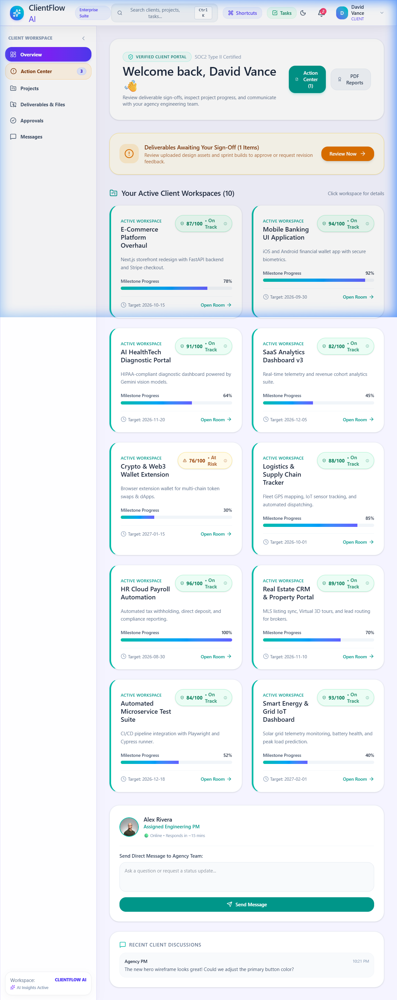
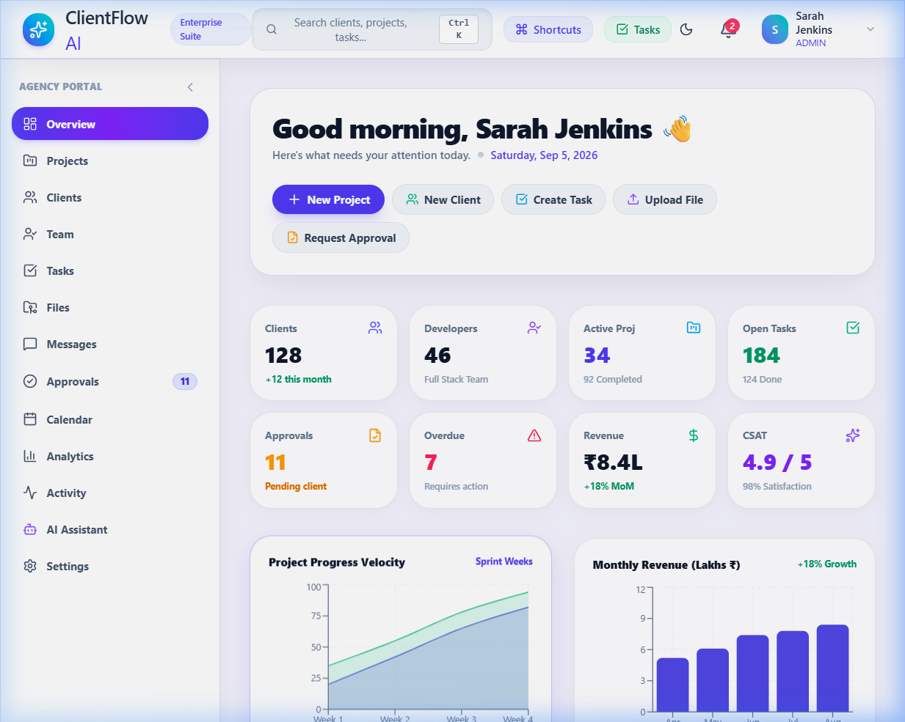
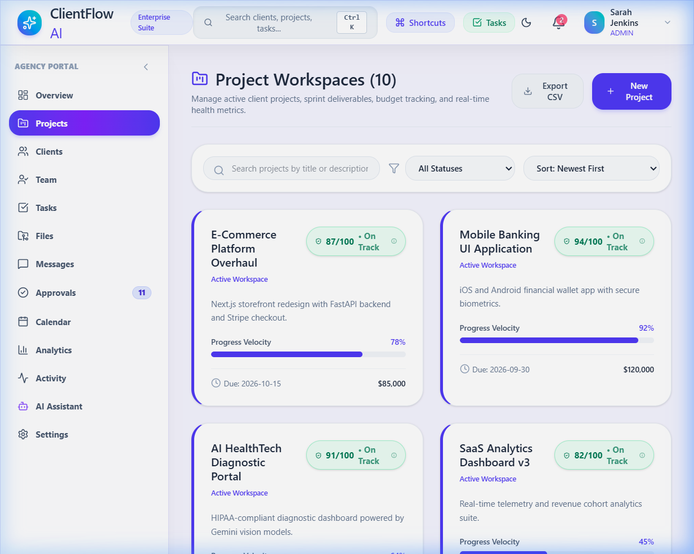
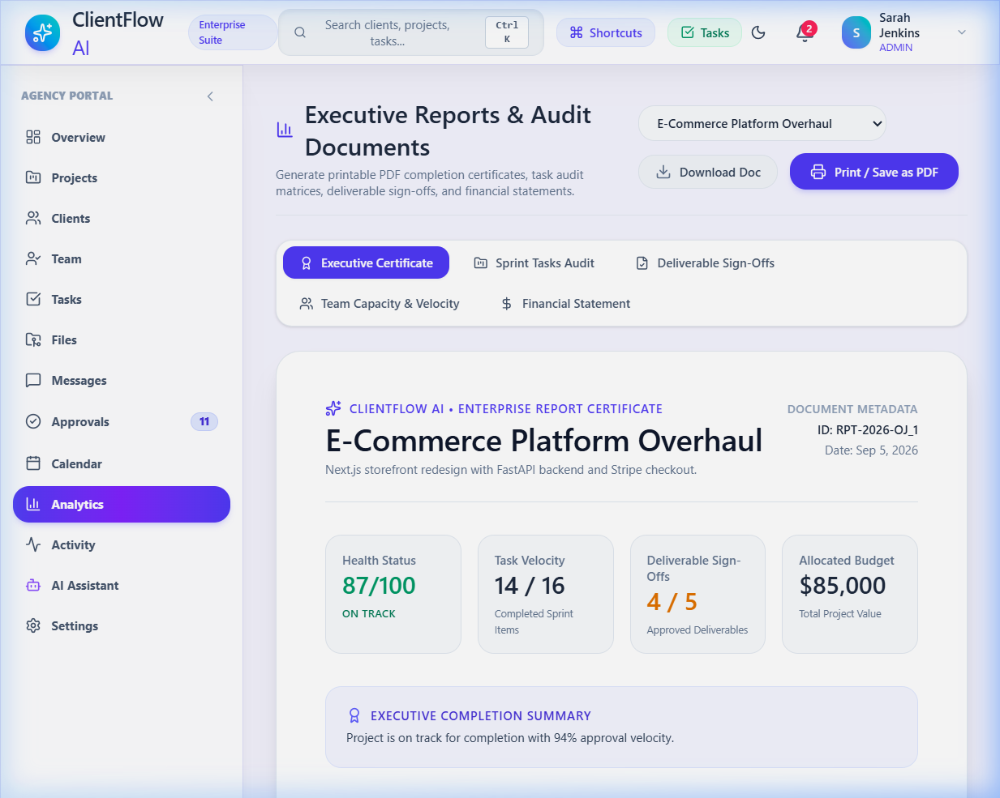

# 🚀 ClientFlow AI - Enterprise Client Portal & Team Workspace Suite

ClientFlow AI is a modern, high-speed multi-tenant client collaboration portal and project management workspace for agencies, software teams, consultancies, and enterprise clients. It unifies client deliverable approvals, versioning history (v1, v2, v3), Kanban task tracking, deterministic project health scoring, Gemini AI feedback-to-ticket extraction, multi-theme color palettes, and publication-grade executive PDF reporting.

---

## 📸 Live Application Screenshots

| Client Side Portal Interface | Agency Overview Dashboard |
| :---: | :---: |
|  |  |

| Project Workspaces | Executive PDF Reports & Audit Documents |
| :---: | :---: |
|  |  |

---

## 🔑 Pre-Seeded Demo Accounts & Credentials

| Role | Email | Password | Primary Workspace Capabilities |
| :--- | :--- | :--- | :--- |
| **Admin** | `admin@clientflow.demo` | `Demo@123` | Full workspace admin, org setup, team management, executive reports |
| **Client Account** | `client@clientflow.demo` | `Demo@123` | Dedicated Client Portal, 1-click deliverable sign-offs, action center |
| **Project Lead (PM)** | `manager@clientflow.demo` | `Demo@123` | Project health telemetry, sprint task creation, deliverable versioning |
| **Senior Developer** | `developer@clientflow.demo` | `Demo@123` | Kanban task moves, code deliverable uploads, story point estimation |

*Note: You can also click any Quick Launch Role Pill on the Client Portal Sign-In Modal to log in instantly!*

---

## 🌟 Major Features & Capabilities

1. **🏢 Enterprise Client Portal & Login System**:
   - Multi-mode sign-in (Password, Magic Link / 6-Digit OTP, Client Project Access Key `KEY-948271`).
   - Quick launch company cards for client accounts (Northstar Labs, Vertex Studio, Quantum Financial, Horizon Media).
   - SOC2 Type II Certified & 256-bit AES encryption security badges.

2. **📄 Executive PDF Reports & Audit Documents**:
   - 📜 **Executive Completion Certificate** (Health score breakdown, velocity metrics, executive summary).
   - 📋 **Sprint Tasks & Backlog Audit Matrix** (Issue types, story points, priority tags, assigned engineers).
   - 💼 **Client Deliverable Sign-Off Certificate** (Versioned file approvals, client feedback notes, timestamped signatures).
   - 👥 **Team Workload & Developer Velocity Audit** (Capacity utilization, completed story points).
   - 💰 **Financial Budget & Expenditure Statement** (Contract budgets, sprint hours, milestone releases).
   - 🖨️ **1-Click PDF Export & Print**: Built-in `@media print` clean styling stripping UI controls for white-page publication reports.

3. **🎨 Dynamic Color Palette & Theme Engine**:
   - Site-wide theme accent switching (Indigo, Atlassian Blue, Emerald Mint, Deep Violet, Sunset Amber).
   - Instant background, surface, text, and gradient overrides in Light & Dark modes.

4. **⚡ Gemini AI Feedback-to-Task Engine**:
   - 1-Click extraction of unstructured client chat feedback into developer Kanban tickets with human PM confirmation.
   - Deterministic 0 - 100 Project Health Engine ($0.35 \times \text{Velocity} + 0.25 \times \text{Safety} + 0.20 \times \text{Approvals} + 0.10 \times \text{Responsiveness} + 0.10 \times \text{Activity}$).

5. **⌨️ Global Keyboard Shortcuts**:
   - Trigger shortcuts modal via `Shift + ?` or `Ctrl + K`.

---

## 🛠 Setup & Local Execution

### Option 1: Frontend Only (Instant Standalone)
```bash
cd frontend
npm install
npm run dev
```
Open **http://localhost:5173**

### Option 2: Full-Stack (FastAPI + SQLite)
```bash
# Terminal 1 - Backend
cd backend
pip install -r requirements.txt
python app/seed.py
uvicorn app.main:app --reload --port 8000

# Terminal 2 - Frontend
cd frontend
npm run dev
```

---

## 🌐 Production Deployment

- **Vercel**: Set root directory to `frontend`, build command `npm run build`, output directory `dist`.
- **Render / Railway**: Set root directory to `backend`, start command `uvicorn app.main:app --host 0.0.0.0 --port $PORT`.

---

© 2026 CLIENTFLOW AI • Enterprise Client & Team Workspace Suite
